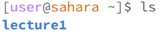
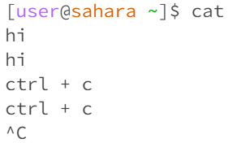
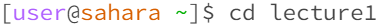
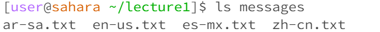
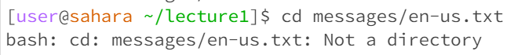
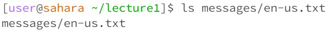

Lab Report 1
---
In this lab, we learned the usage of important commands:

| Command | Description |
| --- | ----------- |
| cd | Title |
| ls | Text |  
| cat | Text |  

Using These are examples of using these key commands in different senarios:  
  
  
  
  
  
  
  
  
  
All commands have the same working directory of /home  
