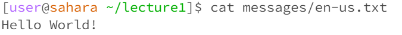

# Lab Report 1

In this lab, we learned the usage of important commands:

| Command | Description |
| --- | ----------- |
| cd | changes the current directory |
| ls | lists all the files within the chosen path |  
| cat | prints the contents of the files within the chosen paths |  

These are examples of using these key commands in different scenarios:  
---
  
**Using cd with no arguments** won't change the current path, because it wasn't given one to change to. So it's not an error because that was an expected outcome, no matter what the working directory was when the command was run, which in this instance was the home directory.  
   
  
**Using ls with no arguments** lists all the files within the current directory, /home. It did what it was supposed to do, making its output not an error.  
   
  
**Using cat with no arguments** causes the user to type in the terminal and after pressing the 'enter' button print what was typed. To exit this state, I had to press 'cntl + c'. I believe this was not an error since it wasn't given any files to print, it would print the user's input. The working directory is /home.  
   
    
**Using cd with a directory as an argument** changes the current path, /home, into /home/lecture1. This is shown in the next line after inputting the cd command, which means there was no error caused.  
   
  
**Using ls with a directory as an argument** shows all the files within the argument messages and not the files that are in the working directory /home/lecture1, which means that the command works!  
   
  
**Using cat with a directory as an argument** showcases the following text. Since a directory is a file that stores files, it means it has no direct text to print out. So the cat command just states that messages is a directory. That's not an error but it isn't what cat is primarily made to do, which is to print out text. The working directory is /home/lecture1.   
   
  
**Using cd with a file as an argument** showcases the following text. Since cd is made to change directories, giving it a file will not work and would cause an error. That's why the text states the argument isn't a directory as a warning. The working directory is /home/lecture1.   
   
  
**Using ls with a file as an argument** restates the file that was given. Also, it didn't just print out the file name alone. Since the argument was a path, ls printed out that path. The working directory is /home/lecture1 and the output isn't an error.   
   
  
**Using cat with a file as an argument** prints out the contents of the file. The working directory is /home/lecture1 and the output isn't an error. 
   

